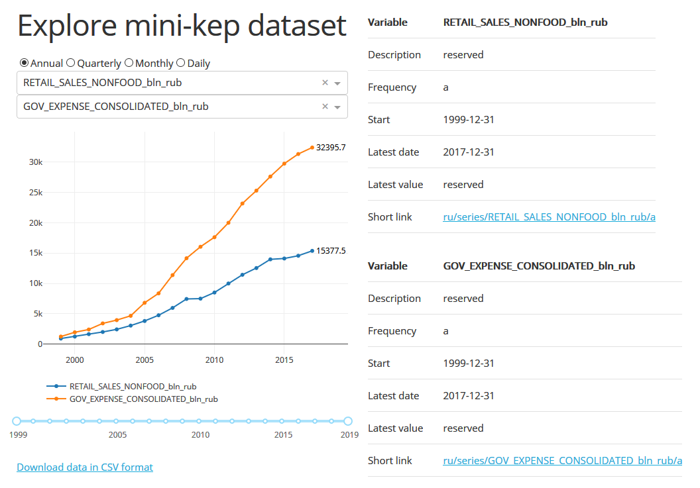

+++
title = "Дэшборд, но не Tableau?"
date = 2019-03-22T04:47:54+03:00
draft = false
tags = ["jupyter", "shiny", "superset"]

# For Facebook
# image = "https://epogrebnyak.github.io/ru/post/2019-03-22-what-if-not-tableau/featured.png"

# Featured image
# To use, add an image named `featured.jpg/png` to your page's folder. 
[image]
  # Caption (optional)
#  caption = ""
  # Focal point (optional)
  # Options: Smart, Center, TopLeft, Top, TopRight, Left, Right, BottomLeft, Bottom, BottomRight
  focal_point = "Center"
  preview_only = true

+++

Хороший дэшборд, как известно, и на радость разработчикам (быстро показали, что хотели) и пользователям (не надо отчеты запрашивать, все и так выкладывается). На
практике чуть сложнее (доступность данных, разграничение доступа, что дальше делать, глядя на красивые данные), но сами средства разработки лучше знать, чем не знать. 

Ниже кратко о вариантах дэшбордов помимо хорошо известных коммерческих систем (Tableaux[^2], Power BI) по мотивам [этого опроса в Твиттере](https://twitter.com/beeonaposy/status/1108817167015993344):

 

[^2]: Расценки на Tableaux [тут](https://twitter.com/mim_djo/status/1108839870753955840), можно смотреть также бесплатный [datastudio.google]( https://datastudio.google.com/navigation/reporting). 

Наиболее известные базовые способы:

- ноутбуки `jupyter`[^3]
- `shiny` (здесь средства `R` круче, чем аналоги на питоне) 
- там, где `shiny`, там и `plotly` и `bokeh` (уже питоновские)
- в приницпе, под дэшборд можно приспособить любую систему 
  публикации `markdown`, `bookdown`, `asciidoc`

<!--
[^1]: Небольшая демонстрация - www-интерфейс к [базе данных временных рядов](http://macrodash.herokuapp.com/)
-->

[^3]: В презентации будет маячить код, но [люди придумали как его выкручивать из ноутбука](https://stackoverflow.com/questions/27934885/how-to-hide-code-from-cells-in-ipython-notebook-visualized-with-nbviewer/28073228#28073228))

Менее известные:

- [flexdashboard](https://rmarkdown.rstudio.com/flexdashboard/) развивает способности `shiny`
- [Quilt](https://alpha.quiltdata.com/b/quilt-example/tree/robnewman/us_county_smoking_vs_poverty) 
 красиво показывает содержание бакета AWS S3, рендерит ноутбуки и прочее (но сам в альфа версии)
- [blazer](https://github.com/ankane/blazer) быстро рисует из запросов SQL в браузере 

Поднять свой сервер для работы с данными (все бесплатные):

- [superset](https://github.com/apache/incubator-superset) (проект Apache Incubator)
- [metabase](https://www.metabase.com)
- анализаторы логов (`Grafana`, `Kibana` и т.д.)
  
Из личного опыта, считайте небольшой рекламой:

- [visyond](https://visyond.com) - также справляется с BI, но помимо этого хорошо подходит для масштабной стандартизации электронных таблиц (когда их в организации обрабатывается много и внутри Excel причесывать долго и сложно, "куда смотерть, если google sheets не хватает").

#### Дополнения

- чудесный мир JavaScript дэшбордов, но в это мире непонятно, какой проект развивается, какой уже нет. Оживленным выглядит [vue-element-admin](https://github.com/PanJiaChen/vue-element-admin).
- низкоуровневая библиотека? `D3.js`! надстройка? `Vega-lite`. А чтобы пользоваться? 
 [Altair](https://altair-viz.github.io/)! (снова питон) 
